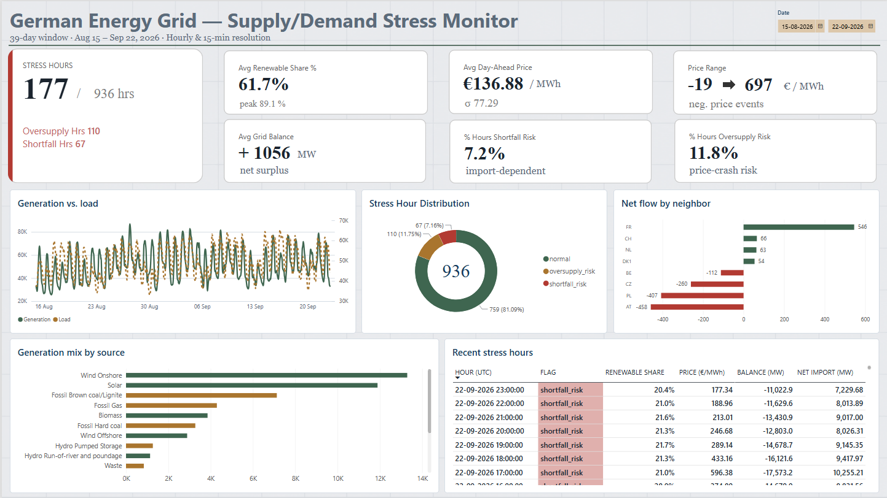
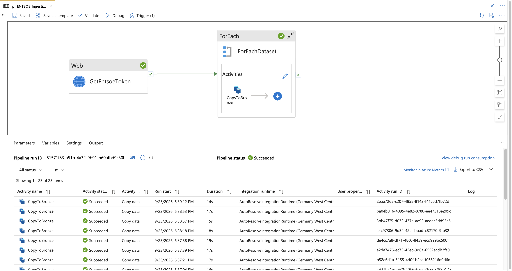
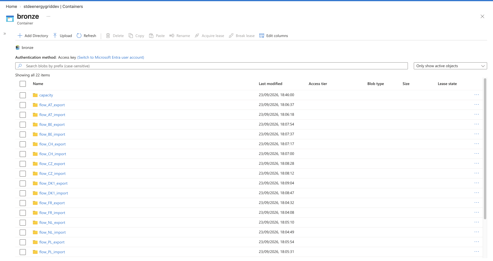
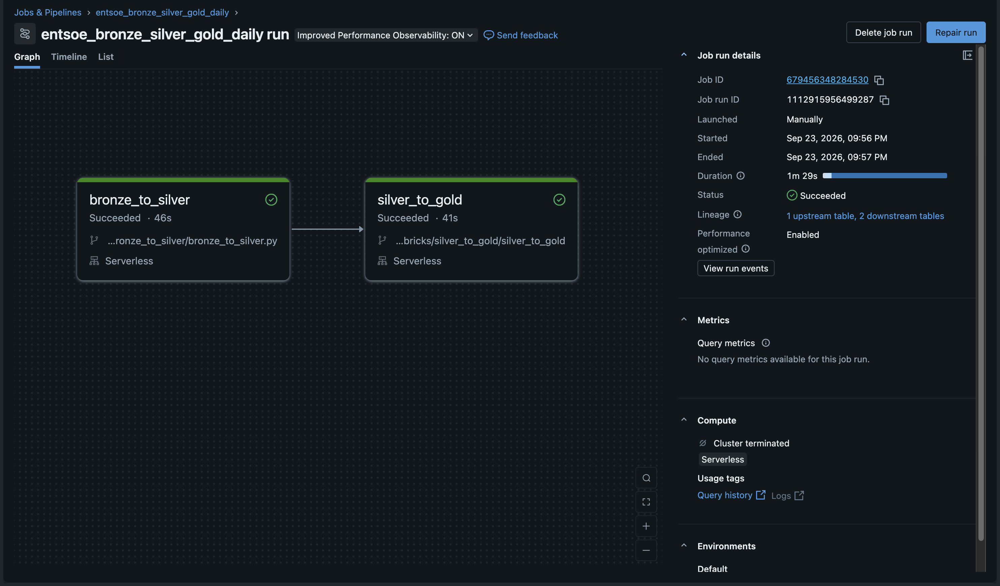
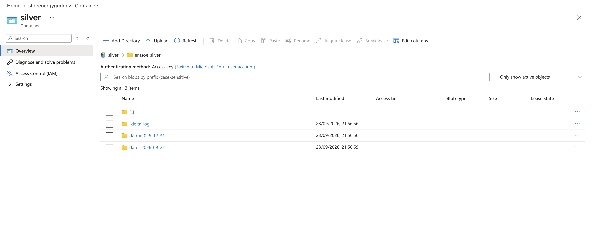

# German Energy Grid Stress Pipeline

An end-to-end data engineering project on Azure: ENTSO-E API → Azure Data Factory → ADLS Gen2 → Databricks (medallion architecture) → Power BI.

It tracks Germany's hourly electricity generation, load, prices and cross-border flows, and flags hours of **oversupply** (renewable-heavy, low price) and **shortfall** (import-dependent) risk.



## Headline results

Over a 39-day window (936 hourly rows):

- **759** normal / **110** oversupply-risk / **67** shortfall-risk hours
- Average renewable share **61.7%** (peak 89.1%)
- Day-ahead price averaged **€136.88/MWh**, ranging from **−€19 to €697** (real negative-price events)
- Oversupply hours are solar-driven: Solar averaged 30,082 MW in those hours against 11,890 MW overall

## Architecture

```
ENTSO-E Transparency API
        │  (Azure Data Factory: 2 parameterized pipelines, scheduled triggers)
        ▼
ADLS Gen2 — Bronze   raw XML, one folder per dataset type
        │  (Databricks Job: bronze_to_silver)
        ▼
ADLS Gen2 — Silver   parsed, gap-aware, date-partitioned Delta
        │  (Databricks Job: silver_to_gold)
        ▼
ADLS Gen2 — Gold     hourly aggregates + stress flag, Delta
        │
        ▼
Power BI (Delta tables read directly from ADLS)
```

## Tech stack

Azure Data Factory · ADLS Gen2 · Azure Key Vault · Managed Identity · Databricks (PySpark) · Delta Lake · Power BI (DAX) · Python · Git-linked ADF and Databricks Jobs

## Data source

[ENTSO-E Transparency Platform](https://transparency.entsoe.eu), German bidding zone (DE-LU): actual generation by type (A75), actual load (A65), day-ahead prices (A44), physical cross-border flows with 8 neighbours (A11), wind/solar and total generation forecasts (A69, A71) and installed capacity (A68). 22 dataset types in total. Data is published under CC BY 4.0 with attribution to ENTSO-E.

## What's in each layer

### Ingestion — Azure Data Factory


- `pl_ENTSOE_Ingestion` (daily): a Key Vault lookup for the API token, then a sequential ForEach over a 21-row config that copies raw XML byte-for-byte into Bronze.
- `pl_ENTSOE_Capacity` (monthly): a separate pipeline because installed capacity is annual data and needs a year window.
- **Security**: Managed Identity for ADF → Storage, and Key Vault only for the one genuine external secret. No credentials in the repo.
- Pipeline JSON is synced to `/adf` through ADF's Git integration.



### Transformation — Databricks



- A Git-sourced Job runs `bronze_to_silver` → `silver_to_gold`, so it always executes what is committed to `main`.
- **Silver** ([notebook](databricks/bronze_to_silver/bronze_to_silver.py)) parses the XML and writes date-partitioned Delta. Partitions are replaced per date, so history is never overwritten.
- **Gold** ([notebook](databricks/silver_to_gold/silver_to_gold.py)) produces hourly generation, load, net import, renewable share and a `stress_flag`:
  - `oversupply_risk`: renewable share ≥ 65% and price ≤ €20/MWh
  - `shortfall_risk`: net imports > 15% of load
  - `normal`: otherwise



### Reporting — Power BI
A one-page report (the `.pbix` is kept out of the repo because it stores storage credentials) connected directly to the Gold and Silver Delta tables. It has a dedicated measures table, a Silver→Gold relationship at hourly grain, and every measure checked against direct DAX queries.

## Data quality handled

The source API has undocumented quirks that would silently corrupt analysis if ignored. Full detail is in [`docs/entsoe_dataset_notes.md`](docs/entsoe_dataset_notes.md).

- **Point compression**: ENTSO-E omits values that repeat the previous one. These are forward-filled per series.
- **Silent gaps**: detected against the requested window and recorded in a gaps table, never fabricated.
- **Duplicate day-ahead prices**: two auction sequences are published. Only the EPEX one is kept.
- **Pumped storage**: consumption is kept separate from generation so it isn't netted away.
- **Price parsing bug**: prices are stored in `<price.amount>`, not `<quantity>`. They silently parsed as null until a blank Power BI measure exposed it. Fixed and reprocessed.
- **Unit bug**: summing 15-minute readings instead of averaging within the hour inflated generation about 4×. Fixed in Gold.
- **Acknowledgement documents** ("no data", e.g. Denmark DK2, which has no direct link to Germany) are detected and skipped.

## Repository layout

| Path | Contents |
|---|---|
| `adf/` | ADF pipelines, datasets, linked services, triggers |
| `databricks/` | Bronze→Silver and Silver→Gold notebooks |
| `ingestion/` | Python reference implementation, exploration scripts and the historical backfill utility |
| `docs/` | Dataset notes and screenshots |

## Running the Python ingestion scripts locally

```bash
cd ingestion
python -m venv venv && source venv/bin/activate
pip install -r requirements.txt
# create a .env in the repo root with ENTSOE_API_TOKEN=<your token> (gitignored)
python fetch_entsoe.py 2026-09-21
python parse_entsoe.py 2026-09-21
```

A free ENTSO-E API token is required: register at transparency.entsoe.eu, then email transparency@entsoe.eu for RESTful API access.

## Design decisions

- **Databricks over lighter tools**: chosen to demonstrate the industry-standard tool, and because the gap/forward-fill logic is code-shaped. At this volume, a lighter option would also have worked.
- **Storage access from Databricks**: Free Edition runs outside Azure, so Unity Catalog storage credentials weren't available. Bronze is read with the `azure-storage-blob` SDK, and real Delta is written to ADLS with `deltalake`.
- **Triggers left paused**: ADF triggers and the Databricks schedule are fully configured but run on demand, to keep the project at $0 spend.

## Known limitations

- Bronze→Silver reprocesses all Bronze files on each run rather than incrementally.
- Stress-flag thresholds are a first pass based on observed ranges, not a calibrated model.
